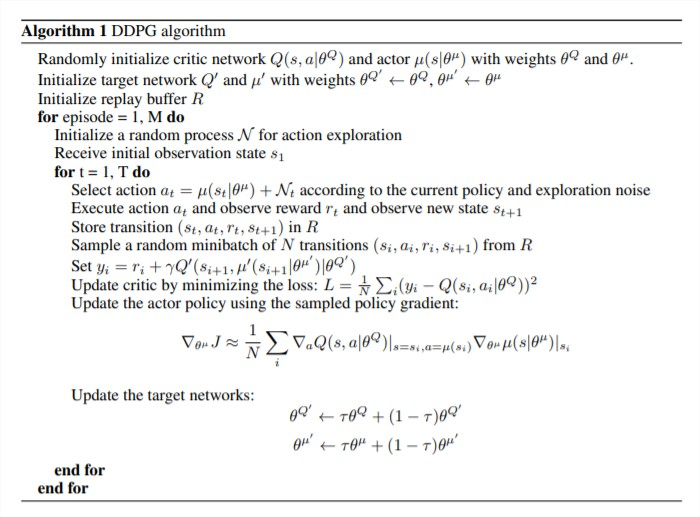
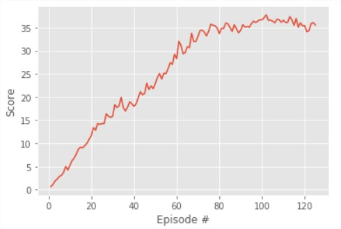

# The learning algorithm
We used the Deep Deterministic Policy Grandient — DDPG — algorithm to solve the environment (original paper: [https://arxiv.org/pdf/1509.02971](https://arxiv.org/pdf/1509.02971))

This algorithm was first introduced by Timothy P. Lillicrap and Jonathan J. Hunt. It was designed to solve problems of reinforcement learning for continuous and high dimensional action spaces, like our case.

This algorithm is a model-free, off-policy actor-critic algorithm. Let's describe:

**Model-free**
We use the neural network to directly output the policy for a given state.

**Off-policy**
The algorithm does not necessarily follow the optimal policy in order to find the optimal policy. In our case,  the agent adds noise to the policy before acting.

**Actor-critic**
The model train 2 networks simultaneously: the actor network to output the policy and the critic network to output a value function, such as the action-value function.

To avoid effect of unwanted correlation existing in past actions, this algorithm uses a replay buffer for storing experiences (each experience is a tuple of states, actions, the rewards and the next states for a given time step). So instead of learn each iteration, it first stores a lot of experiences, them the algorithm take randomly and in random order some of the stored experiences in order to train the two networks. It has a limit of memory for storing experiences, so when it reaches the limit, the first ones are being discarded and new experiences are being added in the memory position.

In order to improve stability of learning, we use the "soft" target updates, instead of simply copying the networks for the targets. That is, the target is a copy of the actor and critic networks that are updated every time step, but with a tau factor that is the proportion of the update that was from the original networks. This way the target networks are updated slowly.

The DDPG algorithm according to the original paper:

# The implementation for multiple agents (20)
We have in our case multiple agents. 
As shown by the google team in the article [How Robots Can Acquire New Skills from Their Shared Experience](http://ai.googleblog.com/2016/10/how-robots-can-acquire-new-skills-from.html "How Robots Can Acquire New Skills from Their Shared Experience"), let's use the following ideas to take advantage of using multiple agents:
1. All the agents has shared memory. All add experiences to the memory and retrieve to train.
2. All the agents has shared networks. In our case, our code will implement in fact only one shared network for each local actor, local critic, target actor and target critic networks, as a class variable for the agent Class.
3. We will first let all the agents train for a number of time steps before training, and add some experiences to the replay buffer. Then we train the networks a number of times using the experiences stored by all agents in the replay buffer.

# The chosen hyper parameters
BUFFER_SIZE = int(1e6)  # replay buffer size
BATCH_SIZE = 128        # minibatch size
GAMMA = 0.99            # discount factor
TAU = 1e-3              # for soft update of target parameters
LR_ACTOR = 1e-3         # learning rate of the actor
LR_CRITIC = 1e-3        # learning rate of the critic
WEIGHT_DECAY = 0        # L2 weight decay
NUM_TRAINS = 20 * 10    # Times to train each step training
TRAIN_EVERY = 20        # Episodes before each training
FC1_UNITS = 400         # Units of first hidden layer
FC2_UNITS = 300         # Units of second hidden layer
ALLOW_BN = True         # Allow Batch Normalization
SIGMA = 0.1             # Ornstein-Uhlenbeck Sigma

# The model architecture for actor and critic
Both actor and critic networks are composed by (in order from input to output):
1. A linear layer with 33 inputs (the size of the states space) and 400 nodes, with batch normalization and Retified Linear (relu) activation function;
2. Another linear layer with 300 outputs and relu activation function. Batch normalization are applyed in this layer only for actor networks.
3. Another linear layer with 4 outputs (the size of the actions space). For the actor networks we add Hyperbolic Tangent Activation Function (TanH).

# Plot of rewards (Average agent score)

# Ideas for Future Work
For future works, we can try:
- Different architectures for the networks, maybe more complex ones, with more layers etc;
- Different known algorithms for learning, such as Trust Region Policy Optimization (TRPO) or [Distributed Distributional Deterministic Policy Gradients (D4PG)](https://openreview.net/forum?id=SyZipzbCb)
- Known strategies for improving DDPG performance, such as [Prioritized Experience Replay](https://cardwing.github.io/files/RL_course_report.pdf) and [Weight Averaging](http://www.gatsby.ucl.ac.uk/~balaji/udl-camera-ready/UDL-24.pdf)